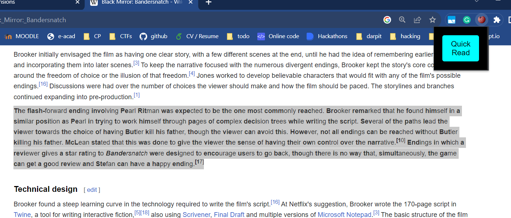

<h1 align='center'>Chrome Extension: Quick-Read</h1>

  
  
(Select a text, make it bionic, and read it quick)

## Overview

**Quick-Read** is a captivating Chrome extension designed to elevate your online reading experience. With a single click, it transforms mundane text into a stylish and visually engaging bionic readable format, making web content not only more exciting but also highly efficient.

Embrace the future of web browsing with these key features:

- 🚀 **Enhanced Reading:** Say goodbye to dull text. Quick-Read brings a touch of innovation to your reading, making every word pop on the screen.

- ⏱️ **Boosted Productivity:** Speed up your information intake and save valuable time, perfect for professionals and students on the go.

- 📚 **Rapid Comprehension:** Quick-Read helps you grasp the content faster with its unique text style, revolutionizing how you consume online information.

- 🎨 **Personalization:** Tailor your reading experience with a range of bionic readable text styles. Express yourself and make your content stand out.

## Features

- Convert selected text into a bionic readable format with a single click.
- Easy installation and integration into the Chrome browser.

## Getting Started

### Installation

1. Clone this repository to your local machine or download it as a ZIP file.
2. Open Chrome and go to `chrome://extensions/`.
3. Enable "Developer mode" at the top right of the page.
4. Click the "Load unpacked" button and select the directory where the extension's files are located.

### Usage

1. Navigate to a webpage in Chrome.
2. Select any text on the webpage by clicking and dragging the mouse.
3. Right-click on the selected text.
4. In the context menu, click "Convert to Bionic Readable Text."

The selected text will be transformed into a bionic readable format instantly.

## Screenshots

  

## License

This project is licensed under the MIT License - see the [LICENSE.md](LICENSE.md) file for details.

## Acknowledgments

The "Quick-Read" Chrome extension was created with the goal of enhancing the reading experience and increasing productivity for users. We believe that this tool offers several notable advantages:

- **Enhanced Reading Experience:** "Quick-Read" transforms text into a more readable and stylish format, making content more visually appealing and engaging.

- **Improved Productivity:** Users can consume information more efficiently, thanks to the bionic readable text format. This feature is especially helpful for busy professionals and students looking to save time while reading.

- **Faster Text Comprehension:** By presenting text in a unique and attention-grabbing style, "Quick-Read" can help users read and understand content more quickly, benefiting both work and study environments.

- **Customization and Personalization:** "Quick-Read" allows users to tailor their reading experience by choosing from various bionic readable text styles, promoting individuality and personal preferences.

- **Innovation in Browsing:** This extension adds a touch of creativity to the browsing experience, demonstrating the potential for innovative text manipulation in web applications.

We're excited to provide this tool to our users and hope it adds value to their online reading and research activities.
Special thanks to the open-source community and contributors for their support and inspiration in making this project possible.

## Support

If you encounter any problems with the extension, please [create an issue](https://github.com/Madhav-MKNC/quick-read/issue) on the GitHub repository.

---

Enjoy transforming text into bionic readable format effortlessly with Bionic Text Converter!
